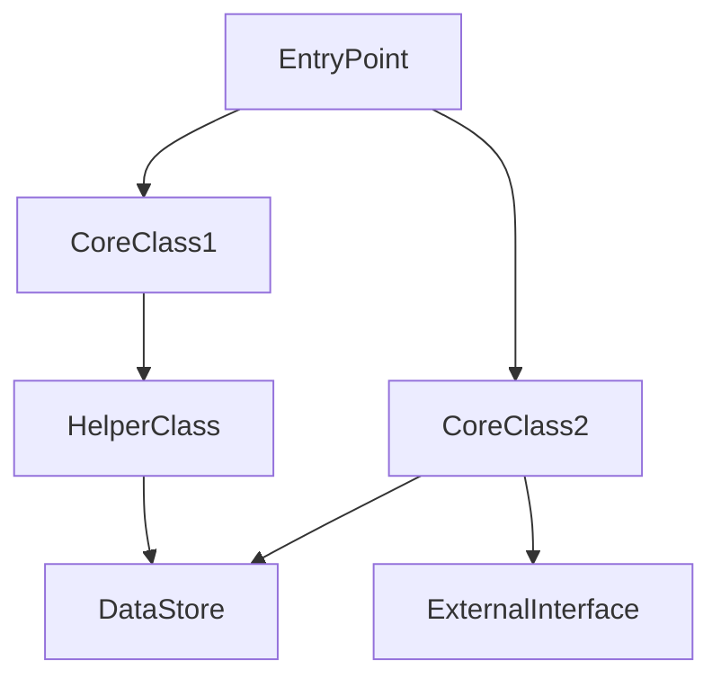

# Codebase Deep Dive

Systematically learn a codebase by combining **purpose understanding**, **competitive analysis**, and **execution-path tracing from a test/example entry point**.

## When to Use

- Learning a new open-source repository
- Understanding how a specific library/framework is implemented
- Pre-implementation research before contributing or forking
- Comparing a codebase against its competitors

## Core Philosophy

Don't start with statistics. Start with **purpose**: what problem does it solve, what makes it special? Then trace from a concrete test or example through the execution path, stopping at each key module to understand architecture as you go.

**All output must be in Chinese. Technical terms (API names, class names, algorithm names, etc.) stay in English.**

## Phase 1: Research & Positioning

### 1.1 Extract Core Features

Read README.md, scan docs/, check project website:
- What problem does it solve?
- What are 3-5 headline features?
- Primary use case / workflow?

### 1.2 Competitive Analysis

Identify 2-4 comparable projects. Document differences: core approach, performance, unique capabilities, ecosystem. Use web search, compare READMEs/docs only. **Do NOT read competitor source code** without user permission.

## Phase 2: Find the Entry Point

### 2.1 Scan for Tests and Examples

```
search_files("*test*", target="files", path="<repo_root>")
search_files("*example*", target="files", path="<repo_root>")
search_files("*demo*", target="files", path="<repo_root>")
```

If nothing found, check `setup.cfg`, `pyproject.toml`, `package.json` for entry points, or ask the user.

### 2.2 Pick a Representative Entry Point

Choose one that exercises the **core workflow**, has **minimal mocking**, is **self-contained**, and covers **headline features** from Phase 1. **Ask user to confirm.**

### 2.3 Read the Entry Point

Identify: setup/config needed, input/output, key function calls.

## Phase 3: Trace, Understand, Document

For each module encountered while tracing the call chain, do three things simultaneously:

1. **Read the file** — understand what it does
2. **Architecture check** — what abstraction does it represent? How does data flow through it? How does it relate to other modules? (feeds Phase 5 Mermaid diagram)
3. **Record decisions** — why was it done this way? What trade-off was made?

### 3.1 Trace the Call Chain

```
test_entry()
  └── setup()
  │     ├── load_config()
  │     └── init_components()
  └── execute()
        ├── step_1()
        └── step_2()
```

### 3.2 Parallel Exploration

When multiple subdirectories need independent exploration, use `delegate_task` in parallel. If unavailable, explore sequentially with `search_files` and `read_file`.

### 3.3 Document Findings

Build a running document as you trace:

| Step | Module | File | What it does | Design choice & trade-off |
|------|--------|------|-------------|--------------------------|
| 1 | Config | src/config.py:45 | ... | ... |

Also collect:
- **Core classes and their relationships** — build a list, will become the Mermaid diagram
- **Architecture decisions** — each with: what, why, trade-off, code location

## Phase 4: Identify Algorithms & Domain Logic

After tracing, step back and identify:

- What are the key algorithms or domain-specific logic patterns?
- For algorithm-heavy repos: map each algorithm to its paper/reference and code location
- What domain concepts does someone need to understand this codebase?

## Phase 5: Synthesize & Output

```markdown
# [Repo Name] Deep Dive
> **Date:** YYYY-MM-DD | **Entry point:** tests/test_xxx.py

## 1. What is this?
[2-3 sentence summary]

## 2. Core Features
- Feature 1
- Feature 2

## 3. Competitive Positioning
| Dimension | This | Alt A | Alt B |
|...

## 4. Algorithms & Domain Concepts
[Key algorithms, papers, algorithm-to-code mapping, domain concepts]

## 5. Core Classes & Interactions


## 6. Execution Trace
[From Phase 3.3 table]

## 7. Architecture Decisions
| Decision | Why | Trade-off | Code |
|...

## 8. Code Navigation Map
src/
├── core/        # Lifecycle, main abstractions
├── pipeline/    # Data flow, processing
└── utils/       # Shared helpers
```

### Persist (optional)

Save to llm-wiki if available: `entities/<repo>.md`, `concepts/<concept>.md`, `comparisons/<repo>-vs-<competitor>.md`.

## Pitfalls

1. **Confirm the entry point with the user.** Wrong test → wrong trace.
2. **Save the output.** A deep dive that stays in conversation history is wasted effort.
